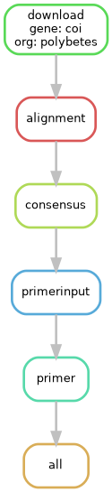

# Primer Design Pipeline

This project implements an automated pipeline for primer design from public genomic sequences, designed for DNA barcoding studies. The workflow is developed with [**Snakemake**](https://snakemake.readthedocs.io/en/stable/) and integrates tools such as [**Biopython**](https://biopython.org/wiki/Documentation), Clustal Omega, EMBOSS, and Primer3.

## Requeriments and specifications

The approach used here depends on `virtualenv` and GNU/Linux environment (specifically it was developed on 24.04.1-Ubuntu).  
External command line tools are required (must be accessible through `PATH`):

| Package                                                       | Command called in Snakefile | Version |
| ------------------------------------------------------------- | --------------------------- | ------- |
| [Clustal Omega ](http://www.clustal.org/omega/clustalo-api/)  | `clustalo`                  | 1.2.4   |
| [EMBOSS](https://emboss.sourceforge.net/docs/)                | `em_cons`                   | 6.6.0.0 |
| [Primer3](https://primer3.org/manual.html#invokingPrimer3)    | `primer3_core`              | 1.1.4   |


Python version employed: 3.11.13. Proyect python dependencies in [**requirements.txt** ](./requirements.txt) file.  
Biopython and Snakemake drives the mayor part of the work.

## Configuration:

The [**config/config.yml**](./config/config.yml) file is load with parameters for the [*Viola*](https://en.wikipedia.org/wiki/Viola_(plant)) and [matK](https://en.wikipedia.org/wiki/Maturase_K) example, see [**notebook/primer_evaluation.ipynb**](./notebooks/primer_evaluation.ipynb) for results and evaluation.

### config.yml fields
```yml
entrez:
  genes: # list[str] of genes
  organisms: # list[str] of organisms
  min_len: # min sequence length (bp)
  max_len:  # max sequence length (bp)
primer3:
  PRIMER_OPT_SIZE:  # optimal primer length (bp)
  PRIMER_MIN_SIZE:  # min primer length (bp)
  PRIMER_MAX_SIZE:  # max primer length (bp)
  PRIMER_PRODUCT_SIZE_RANGE:  # "min-max" (str) range of amplicon

```

## Data Pipeline
Design candidate primers based on a gene region of interest for a given taxonomic group, using NCBI resources and bioinformatics analysis tools. The pipeline automates downloading, alignment, consensus, and input into Primer3. This is achieved using a Snakefile (Snakemake packege). The DAG graph representation of the pipe defined is as follows:

<p align="center">
  <br>
  <small>Example for Viola and matK</small>
</p>

TRAER FUNCIONALIDAD DE RESUMEN DE EXPLORACIÓN!!!!

### Pipe execution
The execution is control and trigged by running `snakemake --core 1` in root proyect directory command ([see oficial doc.](https://snakemake.readthedocs.io/en/stable/executing/cli.html)).

## Primer Evaluation 
### See: [notebooks/primer_evaluation.ipynb](./notebooks/primer_evaluation.ipynb)
The pipeline output results in a series of primers with their corresponding scores. The user can use this criterion to select the best pair.
The cited notebook provides an example of a short test to evaluate the performance of the best primer obtained for the sequences found for the *Viola* matK gene, using tools provided by Biopython and the NCBI database.
