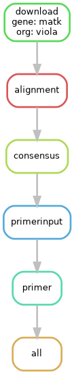

# Primer Design Pipeline

This project implements an automated pipeline for primer design from public genomic sequences, designed for DNA barcoding studies. The workflow is built with [**Snakemake**](https://snakemake.readthedocs.io/en/stable/) and integrates tools such as [**Biopython**](https://biopython.org/wiki/Documentation), Clustal Omega, EMBOSS, and Primer3.

## Requirements and specifications

This pipeline depends on a `virtualenv` Python environment and a GNU/Linux system (specifically developed on Ubuntu 24.04.1).  
External command-line tools are required and must be accessible via the system `PATH`:

| Package                                                       | Command called in Snakefile | Version |
| ------------------------------------------------------------- | --------------------------- | ------- |
| [Clustal Omega ](http://www.clustal.org/omega/clustalo-api/)  | `clustalo`                  | 1.2.4   |
| [EMBOSS](https://emboss.sourceforge.net/docs/)                | `em_cons`                   | 6.6.0.0 |
| [Primer3](https://primer3.org/manual.html#invokingPrimer3)    | `primer3_core`              | 1.1.4   |


Python version employed: 3.11.13.  
Proyect python dependencies are listed in [**requirements.txt** ](./requirements.txt) file.  
Biopython and Snakemake drives most of the pipeline logic.

## Configuration
The pipeline is configured through the **config/config.yml** file.  
All fields are required.

Currently, it supports specifying **a single organism** and **one or more gene/sequence names** (use a list for multiple sequences).

### config.yml fields
```yml
entrez:
  genes:                      # list[str] of gene names
  organisms:                  # str name of organism 
  min_len:                    # minimum sequence length (bp)
  max_len:                    # maximum sequence length (bp)
primer3:
  PRIMER_OPT_SIZE:            # optimal primer length (bp)
  PRIMER_MIN_SIZE:            # minimum primer length (bp)
  PRIMER_MAX_SIZE:            # maximum primer length (bp)
  PRIMER_PRODUCT_SIZE_RANGE:  # range of amplicon size, e.g., "100-300"
```

## Running
#### Step 0 (Mandatory)
Before running the pipeline, you must collect valid NCBI IDs by executing: **`exploration.py`**.
A summary of the NCBI search results will be available in the **logs/** directory, and any retrieved ID lists will be stored in the **data/** directory.
#### Launch pipeline
Once IDs have been successfully retrieved, you can launch the pipeline using the `snakemake` command, for example:

    snakemake --cores N

To execute the pipeline, you must explicitly specify the total number of CPU cores using the `--cores` option. See the [official Snakemake docs](https://snakemake.readthedocs.io/en/stable/executing/cli.html) for details.

As an example, a [**config/config.yml**](./config/config.yml) file is provided with parameters for the [*Viola*](https://en.wikipedia.org/wiki/Viola_(plant)) and [matK](https://en.wikipedia.org/wiki/Maturase_K).  
See [**notebooks/primer_evaluation.ipynb**](./notebooks/primer_evaluation.ipynb) for sample results and an evaluation walkthrough.

### Docker Support

If you don’t want to install the dependencies on your system, you can run the pipeline inside a Docker container.  
Fist, build the Docker image:

    docker build -t primer-pipeline .

Then, run the **ID search** step:

    docker run --rm -v "$PWD":/app -w /app primer-pipeline python3 exploration.py

Finally, the pipeline:

    docker run --rm -v "$PWD":/app -w /app primer-pipeline snakemake --cores N

The `--rm` flag deletes the container after execution. You can remove it if you want to explore the container afterward.

> **Note:** Docker is optional. If your system already has the required tools (`clustalo`, `emboss`, `primer3_core`) and Python dependencies, you can use the pipeline directly.

### **.env** file and `email` environment variable
Include a **.env** file in the root project directory with the following content: 
```dotenv
email="yourmail@example.com"
```
This email is required by NCBI when making Entrez queries.

## Data Pipeline Overview
The pipeline designs candidate primers for a specific gene region in a given taxonomic group using NCBI resources and bioinformatics tools. It automates downloading sequences, multiple alignment, consensus generation, and Primer3 input preparation.
The workflow is defined in the Snakefile (Snakemake).

The DAG (Directed Acyclic Graph) of the pipeline is illustrated below:

<p align="center">
  <br>
  <small>Example for Viola and matK</small>
</p>

### Search Logs (**logs/**)
Information about each sequences retrieved for each search term (organism x gene) is saved as a separate `.log` file within the auto-generated **logs/** directory.

### File outputs (**data/**)
All output files are stored in the auto-generated **data/** directory.

## Primer Evaluation 
### See: [notebooks/primer_evaluation.ipynb](./notebooks/primer_evaluation.ipynb)
The pipeline outputs a set of primers with scoring information.
This notebook demonstrates how to evaluate and interpret the results using Biopython and NCBI resources. It includes an example evaluating the best primer pair found for the *Viola* matK gene.